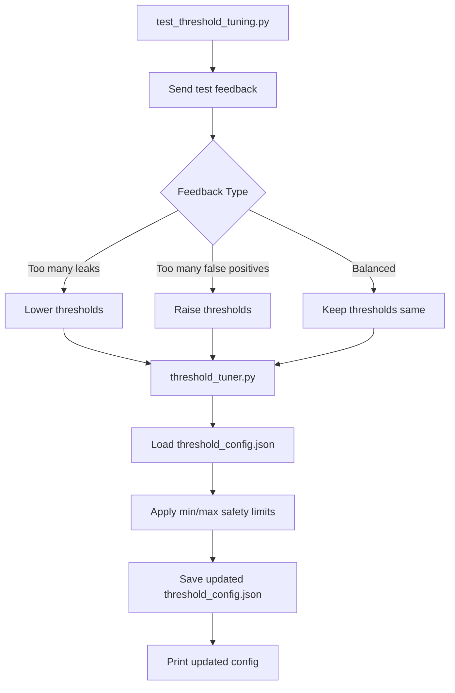

PS C:\Mohanakannan\AI\source\repo\ai-security-lab\AI-Security-Concepts\03-defense-engg\09-adaptive-learning\01-auto-threshold-tuning> & c:/Mohanakannan/AI/source/repo/ai-security-lab/venv/Scripts/python.exe c:/Mohanakannan/AI/source/repo/ai-security-lab/AI-Security-Concepts/03-defense-engg/09-adaptive-learning/01-auto-threshold-tuning/test_threshold_tuning.py
Before tuning:
{'high_threshold': 7, 'medium_threshold': 2, 'min_high_threshold': 5, 'max_high_threshold': 9, 'min_medium_threshold': 1, 'max_medium_threshold': 4}

Case 1: Too many leaks
{'high_threshold': 6, 'medium_threshold': 1, 'min_high_threshold': 5, 'max_high_threshold': 9, 'min_medium_threshold': 1, 'max_medium_threshold': 4}

Case 2: Too many false positives
{'high_threshold': 7, 'medium_threshold': 2, 'min_high_threshold': 5, 'max_high_threshold': 9, 'min_medium_threshold': 1, 'max_medium_threshold': 4}

Case 3: Balanced system
{'high_threshold': 7, 'medium_threshold': 2, 'min_high_threshold': 5, 'max_high_threshold': 9, 'min_medium_threshold': 1, 'max_medium_threshold': 4}
PS C:\Mohanakannan\AI\source\repo\ai-security-lab\AI-Security-Concepts\03-defense-engg\09-adaptive-learning\01-auto-threshold-tuning> 

--------------------------------------------------------
Yes — this system is **not connecting to Ollama or Uvicorn**.

It is a **standalone Python logic test**.

```text
No API
No LLM
No FastAPI server
No Ollama
```

It only reads/writes local files and tests threshold logic.

---

# How These Scripts Work

```text
test_threshold_tuning.py
        ↓
calls tune_thresholds()
        ↓
threshold_tuner.py
        ↓
loads current values from threshold_config.json
        ↓
checks leak_count / false_positive_count
        ↓
updates threshold values
        ↓
saves back to threshold_config.json
```

---

# Flow Diagram



---

# File Roles

## `threshold_config.json`

Stores current threshold values.

Example:

```json
{
  "high_threshold": 7,
  "medium_threshold": 2
}
```

Meaning:

```text
score >= 7 → high risk
score >= 2 → medium risk
below 2 → low risk
```

---

## `threshold_store.py`

Only handles file read/write.

```text
load_thresholds() → reads JSON
save_thresholds() → writes JSON
```

---

## `threshold_tuner.py`

This is the brain.

```text
If leaks are high → system is too loose → lower threshold
If false positives are high → system is too strict → raise threshold
```

---

## `test_threshold_tuning.py`

This is only a test runner.

It simulates feedback:

```python
tune_thresholds(leak_count=4, false_positive_count=0)
```

This does not come from Ollama.
You are manually simulating the result.

---

# Understanding Your Output

## Initial State

```text
high_threshold: 7
medium_threshold: 2
```

---

## Case 1: Too many leaks

```text
leak_count = 4
false_positive_count = 0
```

Meaning:

```text
System missed too many attacks
```

So threshold becomes stricter:

```text
high: 7 → 6
medium: 2 → 1
```

---

## Case 2: Too many false positives

```text
leak_count = 0
false_positive_count = 4
```

Meaning:

```text
System blocked too many safe inputs
```

So threshold becomes relaxed:

```text
high: 6 → 7
medium: 1 → 2
```

---

## Case 3: Balanced

```text
leak_count = 1
false_positive_count = 1
```

Meaning:

```text
System is okay
```

So threshold remains:

```text
high: 7
medium: 2
```

---

# Key Clarification

Right now this is:

```text
offline threshold tuning simulation
```

Later, when integrated with your real system:

```text
attack logs / evaluation results
        ↓
calculate leaks and false positives
        ↓
auto tune thresholds
        ↓
pattern_weighting.py uses updated thresholds
```

So current stage:

```text
Threshold tuning logic ✅ working
Real API/LLM integration ❌ not yet connected
```

That is normal and correct.
