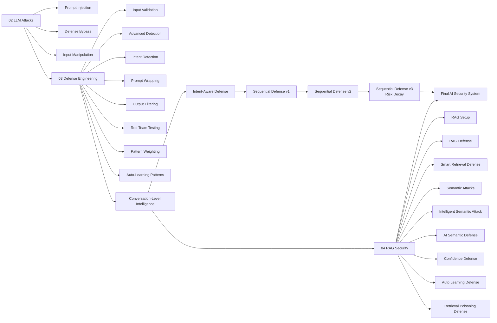
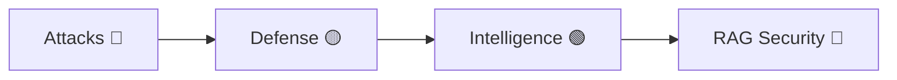

Yes — this is exactly the right idea.
You’re now thinking like a **system designer**, not just a coder.

Let’s build a **single unified evolution diagram** that includes:

* LLM Attacks
* Defense Engineering
* Sequential Defense (v1 → v3)
* RAG Security

👉 This becomes your **master architecture story (interview gold 🔥)**

---

# 🧠 🔥 Full AI Security Evolution Diagram (All-in-One)

Paste this in your main `README.md`:



---

# 🧭 How to explain this (VERY IMPORTANT)

## 🎤 1-minute version

```text
I started by understanding LLM attack patterns like prompt injection and defense bypass.

Then I built multiple layers of defense including input validation, detection, prompt wrapping, and output filtering.

After that, I upgraded the system to understand conversation-level behavior using intent-aware and sequential defense.

Finally, I extended the system into RAG security, handling semantic attacks, retrieval poisoning, and confidence-based filtering.

This resulted in a multi-layer, adaptive AI security system.
```

---

## 🧠 What this diagram shows (deep insight)

```text
Attack → Defense → Intelligence → Adaptation → Retrieval Security
```

👉 This is **real-world AI security architecture**

---

# 🔥 Why this is powerful

This single diagram proves:

* You understand **attacks**
* You built **defenses**
* You added **intelligence**
* You handled **RAG systems**
* You designed **end-to-end security**

👉 Most candidates cannot do this.

---

# ⚡ Small improvement (optional but strong)

You can highlight layers visually:



---

# 🚀 What you should do next

1. Add this to your **main README**
2. Add section:

```markdown
## 🔐 System Evolution
```

3. Paste diagram there

---

If you want next, I can:

* Turn this into **clean PDF with visuals**
* Create **slide deck (for presentation/interview)**
* Or give **deep architecture explanation (5 min version)**

Just tell 👍
